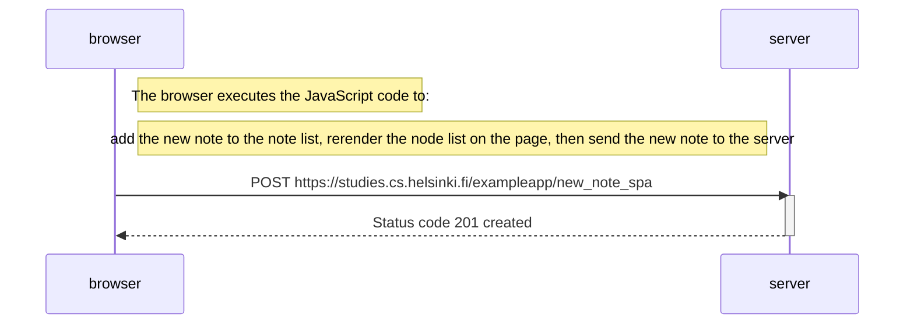

```mermaid
sequenceDiagram
    participant browser
    participant server

    Note right of browser: The browser executes the JavaScript code to:
    Note right of browser: add the new note to the note list, rerender the node list on the page, then send the new note to the server
    
    browser->>server: POST https://studies.cs.helsinki.fi/exampleapp/new_note_spa
    activate server    

    server-->>browser: Status code 201 created
    deactivate server
```